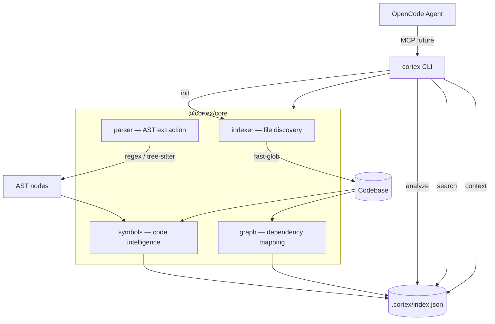

<div align="center">


<br>


**Developer intelligence for your codebase.**
Scans, indexes and understands your project — so coding agents like OpenCode get the right context every time.


<p align="center">
  <a href="#preview">Preview</a> ·
  <a href="#features">Features</a> ·
  <a href="#quick-start">Quick Start</a> ·
  <a href="#commands">Commands</a> ·
  <a href="#architecture">Architecture</a> ·
  <a href="#project-structure">Structure</a> ·
  <a href="#roadmap">Roadmap</a> ·
  <a href="#license">License</a>
</p>

</div>

---

cortex indexes your codebase into a structured knowledge graph — files, symbols, dependencies, architecture — and exposes it through a CLI that coding agents can query. Instead of re-explaining your project to every agent session, you `cortex init` once and the context is always there.

## Preview

```
❯ cortex init

  Scanning C:\my-project...

  cortex initialized

  Files:      142
  Lines:      18.400
  TypeScript: 98
  JavaScript: 12
  JSON:       32

  Index saved to .cortex/index.json
```

```
❯ cortex analyze

  PROJECT ANALYSIS
  ────────────────────────────────────────

  Name:       my-project
  Analyzed:   18/08/2026, 22:00:00

  STATS
  ────────────────────────────────────────
  Files:      142
  Lines:      18.400
  TypeScript: 98
  JavaScript: 12
  JSON:       32

  ARCHITECTURE
  ────────────────────────────────────────
  src                  89 ██████████████
  tests                24 █████
  config               12 ███
  scripts               8 ██
  docs                  6 █
  ...
```

```
❯ cortex search "auth"

  Search: "auth"
  ────────────────────────────────────────

  src/auth/AuthService.ts (38) █████████████
    ✦ class      AuthService
    ✦ function   validate
    ✦ function   refreshToken

  src/auth/AuthController.ts (25) █████████
    ✦ function   login
    ✦ function   callback

  src/middleware/auth.ts (18) ███████
    ✦ function   authenticate
```

```
❯ cortex context "authentication"

  CONTEXT: "authentication"
  ────────────────────────────────────────

  Relevant files:

  → src/auth/AuthService.ts
    ✦ class      AuthService
    ✦ function   validate
    ✦ function   refreshToken

  → src/auth/AuthController.ts
    ✦ function   login
    ✦ function   callback

  → src/middleware/auth.ts
    ✦ function   authenticate

  Dependencies (this file imports):
    ← src/auth/UserRepository.ts

  Dependents (files that import this):
    → src/api/routes.ts
    → src/app/page.tsx
```

## Features

| Feature | Description |
|---|---|
| **Codebase indexing** | Scans your project and builds a structured index of files, symbols and dependencies |
| **Symbol extraction** | Detects classes, functions, interfaces, types, enums, constants — exported and private |
| **Dependency graph** | Maps which files import what, builds a full dependency graph |
| **Architecture analysis** | Shows directory structure, entry points and project composition |
| **Semantic search** | Find files and symbols by relevance, not just filename |
| **Context engine** | Get all relevant files, symbols and dependency chains for a topic |
| **Multi-language** | TypeScript, JavaScript (ESM + CJS), JSON — extensible to more |
| **Fast** | Indexes thousands of files in seconds, no AST overhead |
| **Zero config** | Works out of the box — just `cortex init` in any project |
| **Agent-ready** | Structured output designed for MCP integration with OpenCode |

## Quick Start

### Install

```bash
# Clone and link globally
git clone https://github.com/youruser/cortex.git
cd cortex
pnpm install
pnpm build
pnpm link --global
```

### Use in any project

```bash
cd my-project
cortex init          # scan and create .cortex/index.json
cortex analyze       # see project insights
cortex search "auth" # find relevant code
cortex context "payment" # get full context for a topic
```

## Commands

| Command | Description |
|---|---|
| `cortex init` | Scan codebase and create the index at `.cortex/index.json` |
| `cortex analyze` | Show project stats, architecture, entry points and top symbols |
| `cortex status` | Show index metadata (version, last analysis, file count) |
| `cortex search <query>` | Search files and symbols by relevance score |
| `cortex context <topic>` | Get all relevant files, symbols and dependency chains for a topic |

### Options

| Flag | Description | Default |
|---|---|---|
| `-r, --root <path>` | Project root directory | `process.cwd()` |
| `-i, --include <patterns>` | File glob patterns to include | `**/*` |
| `--ignore <patterns>` | Additional patterns to ignore | — |

### Examples

```bash
# Analyze a specific project
cortex init --root /path/to/project

# Search for specific symbols
cortex search "useEffect"

# Get context before starting work
cortex context "database migration"

# Check when the index was last updated
cortex status
```

## Architecture



**How it works:**

1. **`cortex init`** walks your project with `fast-glob`, reads every source file, extracts symbols with regex-based parsing, builds a dependency graph from imports, and writes everything to `.cortex/index.json`.

2. **`cortex analyze`** reads the index and produces a dashboard: file counts, language breakdown, directory architecture, entry points and the most important symbols.

3. **`cortex search`** scores every file and symbol against your query using path matching, symbol name matching and import relevance — ranked by a weighted scoring function.

4. **`cortex context`** goes deeper: it finds relevant files, resolves their dependency graph (what they import, what imports them), and returns a complete picture of the code area.

### Data model

The index stores everything in a single JSON file:

```json
{
  "version": "0.1.0",
  "project": {
    "name": "my-project",
    "root": "/path/to/project",
    "analyzedAt": "2026-08-18T22:00:00.000Z",
    "stats": {
      "totalFiles": 142,
      "totalLines": 18400,
      "languages": { "typescript": 98, "javascript": 12, "json": 32 }
    }
  },
  "files": [
    {
      "path": "src/auth/AuthService.ts",
      "relativePath": "src/auth/AuthService.ts",
      "language": "typescript",
      "lines": 245,
      "symbols": [
        { "name": "AuthService", "kind": "class", "line": 12, "exported": true },
        { "name": "validate", "kind": "function", "line": 34, "exported": true }
      ],
      "imports": ["./UserRepository", "../middleware/auth"],
      "exports": ["AuthService"]
    }
  ],
  "graph": {
    "edges": [
      { "from": "src/auth/AuthService.ts", "to": "src/auth/UserRepository.ts", "type": "import" }
    ]
  }
}
```

## Tech Stack

| Component | Technology |
|---|---|
| Language | TypeScript 5 (ESM) |
| Runtime | Node.js 22+ |
| Package manager | pnpm 9 (workspaces) |
| File discovery | fast-glob |
| Build | tsup |
| CLI framework | commander |
| Testing | vitest |
| Parsing | Regex-based (tree-sitter planned for v0.2) |

## Project Structure

```
cortex/
├── packages/
│   ├── core/                     # Core library — indexing, parsing, analysis
│   │   └── src/
│   │       ├── types/            # Shared TypeScript types
│   │       ├── indexer/          # File discovery with fast-glob
│   │       ├── parser/           # AST extraction (regex-based)
│   │       ├── symbols/          # Symbol detection (classes, functions, etc.)
│   │       ├── graph/            # Dependency graph builder
│   │       └── index.ts          # Public API — initIndex, loadIndex, etc.
│   │
│   └── cli/                      # CLI interface
│       └── src/
│           ├── commands/
│           │   ├── init.ts       # cortex init
│           │   ├── analyze.ts    # cortex analyze
│           │   ├── status.ts     # cortex status
│           │   ├── search.ts     # cortex search
│           │   └── context.ts    # cortex context
│           └── index.ts          # CLI entry point (commander)
│
├── package.json                  # Monorepo root
├── pnpm-workspace.yaml           # Workspace config
├── tsconfig.json                 # Shared TypeScript config
├── vitest.config.ts              # Test config
└── README.md
```

## Roadmap

| Version | Milestone | What it adds |
|---|---|---|
| **v0.1** | Foundation | Index, analyze, search, context — CLI working |
| **v0.2** | Context Engine | Tree-sitter AST, semantic search, deeper dependency analysis |
| **v0.3** | Memory | Persistent decisions, conventions and patterns per project |
| **v0.4** | Task Planner | Transform vague tasks into structured execution plans |
| **v0.5** | Code Review | `git diff` → architecture, security and test analysis |
| **v0.6** | MCP Server | OpenCode consumes cortex directly via Model Context Protocol |
| **v0.7** | Agents | Specialized agents: architect, reviewer, security, tester |
| **v1.0** | Unified | Complete Developer Intelligence Layer |

## Contributing

Issues and pull requests are welcome. The project is a monorepo managed with pnpm workspaces — run `pnpm install` at the root to set up everything.

```bash
pnpm dev          # watch mode for all packages
pnpm build        # build all packages
pnpm test         # run test suite
pnpm lint         # type-check with tsc --noEmit
```

## License

[MIT](LICENSE) — use it, fork it, index it.

---

<div align="center">

**Built with** TypeScript · Node.js · pnpm · fast-glob · commander

</div>
