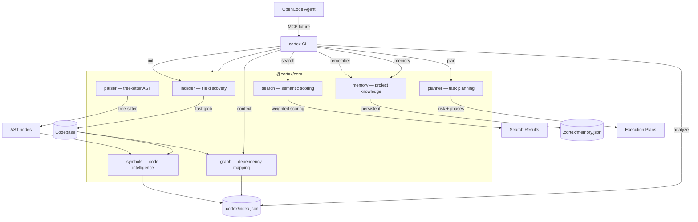

<div align="center">


<br>


**Developer intelligence for your codebase.**
Scans, indexes and understands your project — so coding agents like OpenCode get the right context every time.


<p align="center">
  <a href="#preview">Preview</a> ·
  <a href="#features">Features</a> ·
  <a href="#quick-start">Quick Start</a> ·
  <a href="#commands">Commands</a> ·
  <a href="#architecture">Architecture</a> ·
  <a href="#project-structure">Structure</a> ·
  <a href="#roadmap">Roadmap</a> ·
  <a href="#license">License</a>
</p>

</div>

---

cortex indexes your codebase into a structured knowledge graph — files, symbols, dependencies, architecture — and exposes it through a CLI that coding agents can query. Instead of re-explaining your project to every agent session, you `cortex init` once and the context is always there.

## Preview

```
❯ cortex init

  Scanning C:\my-project...

  cortex initialized

  Files:      142
  Lines:      18.400
  TypeScript: 98
  JavaScript: 12
  JSON:       32

  Index saved to .cortex/index.json
```

```
❯ cortex analyze

  PROJECT ANALYSIS
  ────────────────────────────────────────

  Name:       my-project
  Analyzed:   18/08/2026, 22:00:00
  Version:    0.4.0

  STATS
  ────────────────────────────────────────
  Files:      142
  Lines:      18.400
  TypeScript: 98
  JavaScript: 12
  JSON:       32

  ARCHITECTURE
  ────────────────────────────────────────
  src                  89 ██████████████
  tests                24 █████
  config               12 ███
  scripts               8 ██
  docs                  6 █
  ...

  DEPENDENCY HEALTH
  ────────────────────────────────────────
  Total edges:     156
  Cycles:          0
  Critical path:   12 files
```

```
❯ cortex search "auth"

  Search: "auth"
  ────────────────────────────────────────

  src/auth/AuthService.ts (38) █████████████
    ✦ class      AuthService
    ✦ function   validate
    ✦ function   refreshToken

  src/auth/AuthController.ts (25) █████████
    ✦ function   login
    ✦ function   callback

  src/middleware/auth.ts (18) ███████
    ✦ function   authenticate
```

```
❯ cortex context "authentication"

  CONTEXT: "authentication"
  ────────────────────────────────────────

  Relevant files:

  → src/auth/AuthService.ts (relevance: 38, impact: 12)
    ✦ class      AuthService
    ✦ function   validate
    ✦ function   refreshToken
    Dependencies: src/auth/UserRepository.ts
    Dependents: src/api/routes.ts, src/app/page.tsx
    Transitive deps: 5 total

  → src/auth/AuthController.ts (relevance: 25, impact: 8)
    ✦ function   login
    ✦ function   callback

  → src/middleware/auth.ts (relevance: 18, impact: 3)
    ✦ function   authenticate
```

```
❯ cortex remember "Controllers must never access repositories directly"

  Memory saved
  ────────────────────────────────────────
  Category:   convention
  ID:         mem_1a2b3c
  Created:    19/08/2026, 15:30:00
```

```
❯ cortex memory search "database"

  MEMORY: "database"
  ────────────────────────────────────────

  [convention] mem_1a2b3c — 19/08/2026
    Controllers must never access repositories directly

  [pattern] mem_4d5e6f — 18/08/2026
    Use Repository pattern for all database access

  [decision] mem_7g8h9i — 17/08/2026
    PostgreSQL with Prisma as ORM
```

```
❯ cortex plan "add payment system"

  Add Payment System
  ────────────────────────────────────────
  Plan for: add payment system. 3 module(s) affected (1 high-impact).
  Risk: H HIGH
  Complexity: 42/100
  Tasks: 14

  Risk factors:
    - 1 high-impact module(s) affected
    - Wide scope: 3 modules affected

  Affected modules:
    src/billing [high]
      Contains relevant symbols: BillingService, createInvoice
      symbols: BillingService, createInvoice
    src/api [medium]
      Imports relevant modules: ./billing
    src/models [low]
      Contains relevant symbols: Invoice

  ? DISCOVERY
  ────────────────────────────────────────
    [ ] !! Understand current state of src/billing
        files: src/billing
    [ ] ! Understand current state of src/api
        files: src/api
    [ ] ! Review existing patterns for: BillingService, createInvoice, Invoice

  A ARCHITECTURE
  ────────────────────────────────────────
    [ ] !! Define module boundaries and interfaces
        files: src/billing
    [ ] ! Define data flow and dependencies
        files: src/billing, src/api, src/models
    [ ] ! Design API contracts and service boundaries

  I IMPLEMENTATION
  ────────────────────────────────────────
    [ ] ! Implement BillingService in src/billing
        files: src/billing
    [ ] . Implement createInvoice in src/billing
        files: src/billing

  T TESTING
  ────────────────────────────────────────
    [ ] !! Add tests for src/billing
        files: src/billing
    [ ] ! Add integration tests for cross-module interactions
        files: src/billing, src/api, src/models
    [ ] !!! Verify existing tests still pass
```

## Features

| Feature | Description |
|---|---|
| **Codebase indexing** | Scans your project and builds a structured index of files, symbols and dependencies |
| **Tree-sitter AST** | Proper AST parsing for accurate symbol extraction (classes, functions, types, enums) |
| **Symbol extraction** | Detects classes, functions, interfaces, types, enums, constants — exported and private |
| **Dependency graph** | Maps which files import what, with cycle detection and impact scoring |
| **Architecture analysis** | Shows directory structure, entry points and project composition |
| **Semantic search** | Multi-factor weighted scoring: path, symbol, import, export, structural relevance |
| **Context engine** | Get all relevant files, symbols, dependency chains and impact scores for a topic |
| **Dependency analysis** | Cycle detection, transitive deps, critical path, impact scoring |
| **Project memory** | Persistent decisions, conventions, patterns and mistakes per project |
| **Task planner** | Transform vague tasks into structured execution plans with risk assessment |
| **Multi-language** | TypeScript, JavaScript (ESM + CJS), JSON — extensible to more |
| **Fast** | Indexes thousands of files in seconds with tree-sitter |
| **Zero config** | Works out of the box — just `cortex init` in any project |
| **Agent-ready** | Structured output designed for MCP integration with OpenCode |

## Quick Start

### Install

```bash
# Clone and link globally
git clone https://github.com/benogoulart/Cortex.git
cd cortex
pnpm install
pnpm build
pnpm link --global
```

### Use in any project

```bash
cd my-project
cortex init              # scan and create .cortex/index.json
cortex analyze           # see project insights
cortex search "auth"     # find relevant code
cortex context "payment" # get full context for a topic
cortex remember "use repository pattern"  # save a convention
cortex memory search "pattern"            # recall knowledge
cortex plan "add payment system"          # generate execution plan
```

## Commands

| Command | Description |
|---|---|
| `cortex init` | Scan codebase and create the index at `.cortex/index.json` |
| `cortex analyze` | Show project stats, architecture, dependency health and top symbols |
| `cortex status` | Show index metadata (version, last analysis, file count) |
| `cortex search <query>` | Search files and symbols by semantic relevance score |
| `cortex context <topic>` | Get all relevant files, symbols, dependency chains and impact scores |
| `cortex remember <text>` | Save a decision, convention, pattern or mistake to project memory |
| `cortex memory` | List all memory entries |
| `cortex memory search <query>` | Search through project memory |
| `cortex memory show <id>` | Show a specific memory entry |
| `cortex memory delete <id>` | Delete a memory entry |
| `cortex plan <description>` | Generate a structured execution plan from a task description |

### Options

| Flag | Description | Default |
|---|---|---|
| `-r, --root <path>` | Project root directory | `process.cwd()` |
| `-i, --include <patterns>` | File glob patterns to include | `**/*` |
| `--ignore <patterns>` | Additional patterns to ignore | — |
| `-n, --limit <number>` | Max results for search | `15` |
| `--verbose` | Show score breakdown (search) | — |
| `-d, --depth <number>` | Transitive dependency depth (context) | `3` |
| `-c, --category <type>` | Memory category (remember) | auto-detect |

### Memory Categories

| Category | Description |
|---|---|
| `decision` | Architectural or technical decisions made in the project |
| `convention` | Coding conventions and style rules |
| `pattern` | Reusable patterns and idioms used |
| `mistake` | Known pitfalls and things to avoid |
| `task` | Pending or tracked tasks |
| `note` | General notes about the project |

### Examples

```bash
# Analyze a specific project
cortex init --root /path/to/project

# Search for specific symbols
cortex search "useEffect"

# Get context before starting work
cortex context "database migration"

# Save important decisions
cortex remember -c decision "Use PostgreSQL with Prisma ORM"

# Save conventions
cortex remember "All API responses must follow { data, error } format"

# Save patterns
cortex remember -c pattern "Use repository pattern for database access"

# Save things to avoid
cortex remember -c mistake "Never use setTimeout for debouncing — use lodash.debounce"

# Recall knowledge
cortex memory search "database"
cortex memory search "convention"
```

## Architecture



**How it works:**

1. **`cortex init`** walks your project with `fast-glob`, reads every source file, parses symbols with tree-sitter AST, builds a dependency graph from imports, and writes everything to `.cortex/index.json`.

2. **`cortex analyze`** reads the index and produces a dashboard: file counts, language breakdown, directory architecture, entry points, dependency health (cycles, critical path) and the most important symbols.

3. **`cortex search`** scores every file and symbol against your query using multi-factor weighted scoring: path relevance, symbol name matching, import context, export prominence, and structural importance.

4. **`cortex context`** goes deeper: it finds relevant files, resolves their full dependency graph (direct, transitive, dependents), computes impact scores, and returns a complete picture of the code area with cycle warnings.

5. **`cortex remember`** saves project knowledge (decisions, conventions, patterns, mistakes) to `.cortex/memory.json`. Auto-detects category from text or accepts `--category` flag.

6. **`cortex memory`** searches and retrieves stored knowledge, enabling agents to recall project context across sessions.

7. **`cortex plan`** takes a task description, analyzes the codebase to find affected modules, assesses risk, and generates a phased execution plan with discovery, architecture, implementation, testing, and security tasks.

### Data model

The index stores everything in a single JSON file:

```json
{
  "version": "0.4.0",
  "project": {
    "name": "my-project",
    "root": "/path/to/project",
    "analyzedAt": "2026-08-19T15:00:00.000Z",
    "stats": {
      "totalFiles": 142,
      "totalLines": 18400,
      "languages": { "typescript": 98, "javascript": 12, "json": 32 }
    }
  },
  "files": [
    {
      "path": "src/auth/AuthService.ts",
      "relativePath": "src/auth/AuthService.ts",
      "language": "typescript",
      "lines": 245,
      "symbols": [
        { "name": "AuthService", "kind": "class", "line": 12, "endLine": 80, "exported": true, "signature": "class AuthService" },
        { "name": "validate", "kind": "function", "line": 34, "endLine": 42, "exported": true, "signature": "async validate(token: string): Promise<boolean>" }
      ],
      "imports": ["./UserRepository", "../middleware/auth"],
      "exports": ["AuthService"]
    }
  ],
  "graph": {
    "edges": [
      { "from": "src/auth/AuthService.ts", "to": "src/auth/UserRepository.ts", "type": "import" }
    ]
  }
}
```

Memory is stored separately:

```json
{
  "version": "0.3.0",
  "entries": [
    {
      "id": "mem_1a2b3c",
      "text": "Controllers must never access repositories directly",
      "category": "convention",
      "tags": ["architecture", "controllers", "repositories"],
      "createdAt": "2026-08-19T15:30:00.000Z",
      "context": ["src/controllers/", "src/repositories/"]
    }
  ]
}
```

## Tech Stack

| Component | Technology |
|---|---|
| Language | TypeScript 5 (ESM) |
| Runtime | Node.js 22+ |
| Package manager | pnpm 9 (workspaces) |
| File discovery | fast-glob |
| Build | tsup |
| CLI framework | commander |
| Testing | vitest |
| Parsing | tree-sitter (TypeScript, JavaScript) |

## Project Structure

```
cortex/
├── packages/
│   ├── core/                     # Core library — indexing, parsing, analysis
│   │   └── src/
│   │       ├── types/            # Shared TypeScript types
│   │       ├── indexer/          # File discovery with fast-glob
│   │       ├── parser/           # AST extraction (tree-sitter + regex fallback)
│   │       ├── symbols/          # Symbol detection (classes, functions, etc.)
│   │       ├── graph/            # Dependency graph with cycle detection
│   │       ├── search/           # Semantic search with weighted scoring
│   │       ├── memory/           # Persistent project knowledge
│   │       ├── planner/          # Task planning and risk assessment
│   │       └── index.ts          # Public API
│   │
│   └── cli/                      # CLI interface
│       └── src/
│           ├── commands/
│           │   ├── init.ts       # cortex init
│           │   ├── analyze.ts    # cortex analyze
│           │   ├── status.ts     # cortex status
│           │   ├── search.ts     # cortex search
│           │   ├── context.ts    # cortex context
│           │   ├── remember.ts   # cortex remember
│           │   ├── memory.ts     # cortex memory
│           │   └── plan.ts       # cortex plan
│           └── index.ts          # CLI entry point (commander)
│
├── .gitignore
├── package.json                  # Monorepo root
├── pnpm-workspace.yaml           # Workspace config
├── tsconfig.json                 # Shared TypeScript config
├── vitest.config.ts              # Test config
├── CHANGELOG.md                  # Auto-generated changelog
├── logo.png                      # Project logo
├── wordmark.png                  # Wordmark
└── README.md
```

## Roadmap

| Version | Milestone | What it adds |
|---|---|---|
| **v0.1** | Foundation | Index, analyze, search, context — CLI working |
| **v0.2** | Context Engine | Tree-sitter AST, semantic search, deeper dependency analysis |
| **v0.3** | Memory | Persistent decisions, conventions and patterns per project |
| **v0.4** | Task Planner | Transform vague tasks into structured execution plans |
| **v0.5** | Code Review | `git diff` → architecture, security and test analysis |
| **v0.6** | MCP Server | OpenCode consumes cortex directly via Model Context Protocol |
| **v0.7** | Agents | Specialized agents: architect, reviewer, security, tester |
| **v1.0** | Unified | Complete Developer Intelligence Layer |

## Contributing

Issues and pull requests are welcome. The project is a monorepo managed with pnpm workspaces — run `pnpm install` at the root to set up everything.

```bash
pnpm dev          # watch mode for all packages
pnpm build        # build all packages
pnpm test         # run test suite
pnpm lint         # type-check with tsc --noEmit
```

## License

[MIT](LICENSE) — use it, fork it, index it.

---

<div align="center">

**Built with** TypeScript · Node.js · pnpm · tree-sitter · fast-glob · commander

</div>
